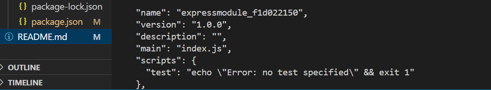
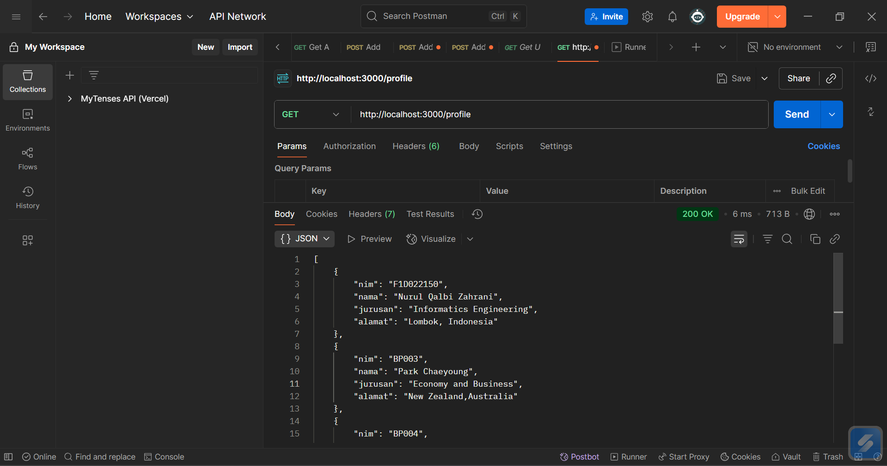

# 📘 Assignment: Express.js & Modul Node.js

# 👤 Identitas
- Nama      : Nurul Qalbi Zahrani
- NIM       : F1D022150

## 📌 1. Deskripsi Tugas

 Implementasi Express.js dan modul lokal pada Node.js dengan membuat server sederhana dan memanfaatkan route modular untuk menampilkan perhitungan matematika sederhana, daftar data pengguna, serta profil pengguna. 

## 📂 2. Hasil

### 2.1 Hasil: Struktur Proyek
📂 documentation    : Screenshot output program
 
📂 expressModule_F1D022150 
====📂node_modules          : Folder hasil command "npm install"yang berisi dependency dari project. 
====📂public                : Fitur tambahan berupa interface yang lebih interaktif dan menarik 
====📂routes                : Menyimpan route modular, yaitu profile.js untuk menampilkan profil pengguna. 
====📂utils                 : Menyimpan modul lokal untuk fungsi perhitungan, yaitu math.js 
====📄 index.js             : App utama untuk inisialisasi Express, middleware, dan koneksi route. 
====📦 package-lock.json    : File yang mencatat versi detail dependency yang diinstall. 
====📦 package.json         : File konfigurasi project (nama, versi, script, dependency) 
🛈 README.md                 : Dokumentasi

### 2.2 Hasil Fitur-fitur
🔢 Perhitungan Matematika    : Tambah, kurang, kali, bagi, modulus, akar kuadrat, pangkat.

👥 Daftar User               : Menampilkan data user.

🪪 Profil User               : Menampilkan data diri dari route modular.
 
📥 Form Input                : Input angka yang ingin dihitung melalui form lalu hasil ditampilkan di browser.

✨ Interface                 : Pada folder public, terdapat css sebagai fitur tambahan untuk membuat tampilan sederhana berupa warna font serta layout website agar lebih menarik, tidak hanya teks seperti CMD.

### 2.3 Hasil Persiapan Environment
1. Membuat folder expressModule_F1D022150

2. Inisialisasi project Node.js dengan npm init -y.

3.	Install Express.js dengan npm install express.

4.	Buat folder utils/

5.	Buat folder routes/

### 2.3 Hasil Output Program

•	GET http://localhost:3000/          : menampilkan NIM dan Nama
#### 
Hasil Website  

#### 
 Pada menu utama, disediakan link untuk rute ke halaman-halaman lain sehingga pengguna tidak perlu mengganti manual halaman 

#### Hasil Postman 

•	GET http://localhost:3000/hitung    : menampilkan hasil perhitungan
#### 
Hasil Website  

#### 
 Pada menu hitung, disediakan form sehingga angka bisa dinamis dari user dan dapat dicoba berkali-kali 

#### Hasil Postman

•	GET http://localhost:3000/profile   : menampilkan JSON array profile
#### Hasil Website

#### Hasil Postman

•	GET http://localhost:3000/profile/1 : menampilkan detail profile (data anda sendiri) dengan nim=F1D022150
#### Hasil Website

#### Hasil Postman

